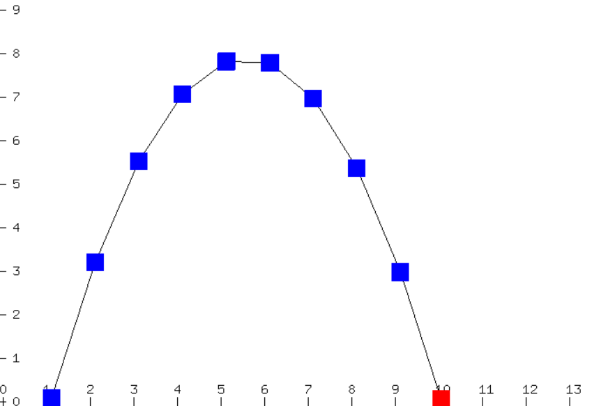

# Physics-Simulator

This is a physics simulator that I created for my senior project. It current simulates elastic collisions, projectile motion, and friction. 

### Hotkeys

#### Simulations
A: Elastic Collision  
S: Projectile Motion  
D: Friction  
R: Reset Current Simulation   

#### Extra Info
Z: Toggle on/off scale  
X: Toggle on/off snapshots  
